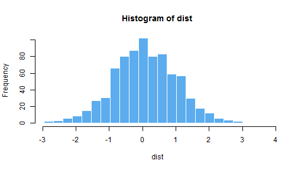

## Introduction

Distribution Histogram Generator is an AWESOME app that allows you to generate random distributions of different types.

- The app has been created with Shiny, a library used in R.

- It is hosted in shinyapps.io and accessible to everybody.

The application uses two files: a ui.R and Server.R:

- The ui.R show the graphical interface to the user and captures the input.

- The Server.R process the input and provides an output, that will be displayed by the ui.R again.

--- .class #instructions 

## Instructions

1. Open a new tab in your web browser an type: http://asteradum.shinyapps.io/DistributionHistogramGenerator

2. You can select different distrbutions: Uniform, Normal, Exponential and Logaritmic.

3. Decide the number of observations to use. More observations will make the distribution more similar to the theoretical distribution.

4. Decide the number of breaks.

5. Decide the color. If you type a color which does not exist, it will throw an error.

--- .class #techinfo

## Technical information

Depending on the option choosen, a diferent distribution will be executed, but all of them have the same pattern. The code in a normal R script will be something like this:


```r
obs = 780
dist <- rnorm(obs)
breaks <- seq(min(dist), max(dist), length.out = 25)
hist(dist, breaks = breaks, col = 'steelblue2', border = 'white')
```

 

--- .class #ShinyApp

## Demo

<iframe src = 'http://asteradum.shinyapps.io/DistributionHistogramGenerator' height='600px'></iframe>

--- .class #id 

## Should I use it?

This tool is ideal for showing the basic of statistics to new students:

- Which different kinds of distributions exist.

- Let your students know what is the difference between the theoretical normal distribution and a normal distribution with different number of observations.

Do not use it if:

- You don't like awesome apps like this one.

- You want to be hipster and avoid mainstream trends.


